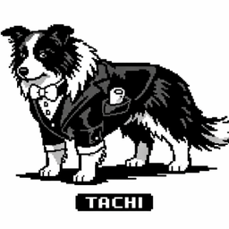

# Tachi Noti



Native macOS notifications for [Claude Code](https://code.claude.com) hooks, delivered by **Tachi** — a Border Collie butler who watches your sessions so you don't have to. A single fast Rust binary, zero runtime dependencies.

## Meet Tachi

Tachi is a sharp-eyed Border Collie in a tailcoat and bow tie. Herding is in his blood; these days the flock is your Claude Code sessions. He keeps quiet while you're at the terminal — a good butler never interrupts — but the moment you wander off and something needs you, he pads over with a discreet announcement: the task is done, or Claude is waiting on your word. One session, one notification; he tidies up after himself.

His portrait rides along inside the binary, so every notification arrives with his face on it:


## What he announces

- **Task complete** (`Stop`) — repo name, `repo @ branch` subtitle, Claude's last reply (truncated), elapsed time, with a sound of your choosing — including **Tachi's own woof** (embedded in the binary, auto-installed to `~/Library/Sounds/TachiBark.aiff`). Pick it from the tachi-bar menu (Completion Sound) or set it in config.
- **Needs your input** (`Notification`: permission prompt / idle) — the prompt message, Basso sound, so you can tell "done" from "waiting" by ear.
- **Focus suppression** — no notification when the terminal/IDE hosting the session is already frontmost. (A butler doesn't announce guests you're already talking to.)
- **Click-to-focus** — clicking the notification activates the right app (requires `terminal-notifier`). For VS Code-family apps (VS Code, Cursor, Antigravity, Windsurf, …) it focuses the exact window that has the session's project folder open, even with multiple windows of the same app.
- **Notification history** — every announcement is logged; `tachi-noti log` shows what you missed.

## Tachi Bar — the menu bar kennel

`tachi-bar` is an optional, tiny (~2 MB) menu bar companion that watches every live Claude Code session at once:

- Sessions **grouped by repo root** (worktrees get their own groups), each row carrying a native tinted status dot, with the elapsed time ticking live while the menu is open. The semantics are strict: **green = working, yellow = blocked on you, gray = turn finished (free capacity)**. Claude Code's `idle_prompt` ("you haven't replied for a minute") is deliberately ignored — a finished session is spare capacity, not a blocker, and letting it turn yellow made every session scream for attention.
- Yellow rows say **what** they're blocked on: `plan ready?` (ExitPlanMode approval), `question?` (AskUserQuestion), `permission · <command>` (the exact command inline, full text on hover). Permission detection uses the `PermissionRequest` hook (fires only when a dialog actually appears, so auto-allowed tools never show as waiting).
- The menu bar shows a dog symbol with at-a-glance counts like `🐕 ●1 ●2 ●3` — waiting first (it needs you), then running, then idle (so spare sessions register without opening the menu); just the dog when no sessions exist. Stale "running" sessions that died without cleanup are demoted automatically so the counts stay honest. Each session records its Claude process pid, and the bar reaps sessions whose process is gone — quitting the IDE (which never fires `SessionEnd`) removes its sessions from the menu within seconds instead of leaving 12-hour ghosts.
- **Click a session to jump to its exact IDE window** (same window-precise focus as the notifications).
- A **Usage section** with your official Claude Code rate-limit numbers — 5-hour and weekly utilization with reset countdowns — plus a red ⚠ in the menu bar title when either window crosses `usage_alert_pct` (default 80, 0 to disable). The data comes from Claude Code's own statusLine payload: `tachi-noti install` puts a tiny capture stage (`tachi-noti statusline --chain '<your original statusline>'`) at the front of your statusLine pipeline — your existing statusline keeps rendering, zero network calls, no OAuth-token shenanigans (Anthropic's ToS bans third-party use of those, and the unofficial endpoint is blocked anyway). Transcript-based estimators were rejected too: their token counts are off by 46–100×. Pro/Max only — API-key accounts get no `rate_limits` payload.
- A "Recent notifications" submenu (last 5), **two sound pickers** — Completion Sound (Stop) and Attention Sound (permission / question / plan) — listing Tachi's bark, your own `~/Library/Sounds`, every system sound, or silent (plays a preview on selection and persists to config), a Launch-at-Login toggle, a **Restart Tachi Bar** item (kicks the launchd agent when it manages the process, otherwise hands over to a fresh copy), and Quit.

No daemon, no IPC: the hooks write tiny per-session state files under `~/Library/Application Support/tachi-noti/state/`, and the bar re-reads them every 2 seconds.

```sh
cargo install --path . --features bar   # installs tachi-noti + tachi-bar
tachi-bar                               # run it
tachi-bar install-agent                 # optional: start at login (launchd)
```

## Install

```sh
cargo install --path .
tachi-noti install       # adds hooks to ~/.claude/settings.json (backs up first)
tachi-noti test          # fire a sample notification
```

Restart your Claude Code session to pick up the hooks. `tachi-noti install --scope project` writes to `./.claude/settings.json` instead. `tachi-noti uninstall` removes only tachi-noti's entries.

### Notification backend

tachi-noti auto-detects the best available backend:

1. **terminal-notifier** (`brew install terminal-notifier`) — grouping (one notification per session, replaced in place), click-to-focus, and Tachi's portrait on the notification.
2. **osascript** — built into macOS, always works. Notifications are attributed to "Script Editor"; on first use macOS asks for notification permission (System Settings → Notifications → Script Editor). No custom image on this backend.

## Configuration

Optional, at `~/.config/tachi-noti/config.toml`. Defaults shown:

```toml
focus_suppression = true   # skip notification when the session's app is frontmost
min_duration_secs = 0      # skip Stop notifications for turns shorter than this
max_body_len = 120         # truncate notification body to this many chars
# backend = "osascript"    # force a backend instead of auto-detect
# icon = "/path/to.png"    # notification image; unset = Tachi's portrait, "" = none

[sounds]
stop = "Glass"             # completion sound: "TachiBark" = Tachi's woof,
                           # "" = silent, or any sound name from ~/Library/Sounds
                           # or /System/Library/Sounds (extension dropped).
attention = "Basso"        # permission / question / plan-approval sound.
                           # Both settable from the tachi-bar menu (with preview).
```

## Commands

| Command | What it does |
|---|---|
| `tachi-noti hook` | Reads a hook event JSON from stdin and notifies. Used by the hooks; always exits 0 so it can never block Claude Code. |
| `tachi-noti install [--scope user\|project]` | Safely merges hook entries into settings.json: timestamped backup, append-only (existing hooks untouched), idempotent, atomic write. Aborts rather than touch a file it can't parse. |
| `tachi-noti uninstall [--scope ...]` | Removes only tachi-noti's hook entries. |
| `tachi-noti log [-n N]` | Shows the last N notifications (default 20) with relative timestamps. |
| `tachi-noti test` | Sends a sample notification and prints the active backend. |
| `tachi-noti doctor` | Prints backend, bundle-id detection, config, install status per scope, live sessions, history stats. |
| `tachi-bar` | Runs the menu bar session monitor (`--features bar` build). |
| `tachi-bar install-agent` / `uninstall-agent` | Adds/removes a launchd agent so the bar starts at login. |

## How it works

The installed hooks are:

- `SessionStart` / `SessionEnd` — create and remove the session's state file (also prunes files older than 48 h).
- `UserPromptSubmit` — marks the session running and stamps the task start time; no notification.
- `Stop` — marks it idle, reads the last assistant message from the transcript JSONL (tail-reads the last 256 KB, skips tool-use-only and subagent lines), computes elapsed time, notifies, logs to history. **Background-aware:** when the Stop payload's `background_tasks` still lists a running task (a background subagent or background bash the main turn launched and didn't wait for), this is the main turn yielding, not the work finishing — the notification is suppressed and nothing is logged, so the real final Stop (once `background_tasks` has drained) rings exactly once instead of firing a premature "complete" for every yield. Versions of Claude Code that don't emit `background_tasks` fall back to ringing on every Stop, as before.
- `PermissionRequest` — the **primary** permission signal: it fires only when a dialog actually appears, so tools auto-allowed by your allowlist, acceptEdits, or auto mode can never produce a false alert (Claude Code's `Notification` event does fire spuriously in those modes — upstream issue #30233, closed as not-planned). It carries structured tool info: ExitPlanMode → "plan ready", anything else → permission with the exact command/file in the popup.
- `Notification` (matcher `permission_prompt|idle_prompt`) — legacy fallback for Claude Code versions without PermissionRequest. A 10-second dedup window guarantees one popup per dialog regardless of which event lands first, and its generic message never overwrites the structured detail. Skipped under `bypassPermissions`; idle prompts are ignored by design.
- `PreToolUse` (matcher `AskUserQuestion`) — Claude Code fires **no Notification** for multiple-choice questions (the session waits silently); this hook both marks the wait and sends the otherwise-missing popup with the question text.
- `PostToolUse` — flips waiting back to running once a permission is answered; plan/question waits are only cleared by their own tool completing, so a parallel subagent's tool results can't hide them. Otherwise just a ≤1-per-minute liveness heartbeat.

Upgrading from v0.1: run `tachi-noti install` again — it appends only the missing hook events (`doctor` will remind you).

Implementation notes:

- The session's host app is identified by the `__CFBundleIdentifier` env var (falls back to a `TERM_PROGRAM` map), used both for click-to-focus and for frontmost comparison via `lsappinfo`.
- Notification text is passed strictly via argv (AppleScript `on run argv` / discrete `Command` args) — message content can never be injected into a shell or script.
- Git branch is read directly from `.git/HEAD` (handles worktrees and detached HEAD) — no `git` subprocess.
- Tachi's portrait is embedded with `include_bytes!` and materialized to `~/Library/Caches/tachi-noti/tachi-head.png` on first use; it's passed as both `-appIcon` and `-contentImage` since recent macOS ignores the former.
- Debugging: `TACHI_NOTI_DEBUG=1` logs hook errors to `~/Library/Caches/tachi-noti/debug.log`; otherwise the hook path is silent by design.
